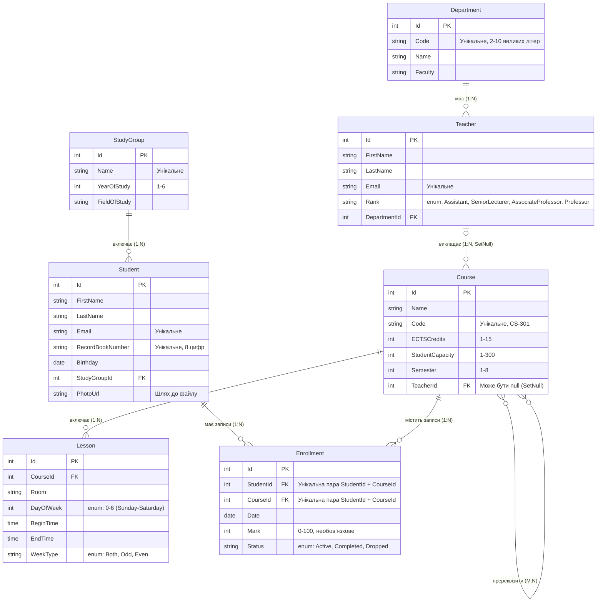

*   **Enrollment (Запис на курс):** Логічно це зв'язок багато-до-багатьох, але він змодельований як окрема сутність, оскільки несе власні бізнес-дані: дату запису, оцінку та поточний статус.
*   **Пререквізити (Course - Course):** Факт того, що один курс є пререквізитом для іншого, не має додаткових атрибутів на логічному рівні. Однак для EF Core це самопосилання M:N потребує явної конфігурації проміжної таблиці. У базі даних це буде таблиця CoursePrerequisites із двома зовнішніми ключами: int CourseId та int PrerequisiteId, які посилатимуться на таблицю Course. Згідно з бізнес-правилами, курс НЕ МОЖЕ бути пререквізитом самому собі.
*   **Сурогатні ключі (Id):** Незважаючи на наявність природних унікальних ідентифікаторів, первинними ключами всюди обрано числові `Id` для оптимізації `JOIN` та стабільності ключів.
*   **Політика видалення:** 
    *   При видаленні викладача його курси залишаються без лектора (поле `TeacherId` стає `NULL`, поведінка `SetNull`)[cite: 2].
    *   Видалення кафедри з викладачами або групи зі студентами (Department -> Teacher і StudyGroup -> Student) суворо заборонене на рівні бази даних (поведінка `Restrict`)[cite: 2].