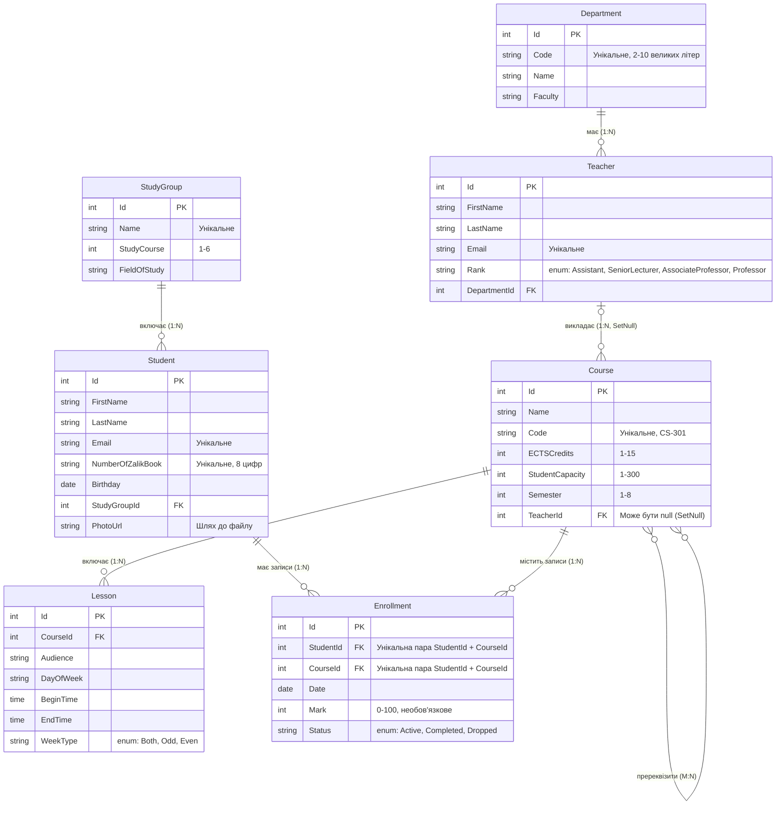

* **Пререквізити (Course - Course):** Факт того, що один курс є пререквізитом для іншого, не має додаткових атрибутів (оцінок чи дат). Тому на логічній діаграмі це прямий зв'язок M:N без виділення окремої сутності. Проміжна таблиця буде згенерована EF Core неявно.
* **Сурогатні ключі (Id):** Незважаючи на наявність природних унікальних ідентифікаторів (Email, NumberOfZalikBook, Code), первинними ключами всюди обрано числові `Id`. Це конвенція EF Core, що забезпечує швидкість операцій `JOIN` та незмінність ключів.
* **Політика видалення:** При видаленні викладача його курси залишаються без лектора (поле `TeacherId` стає `NULL`, поведінка `SetNull`), щоб не втратити історію курсів.